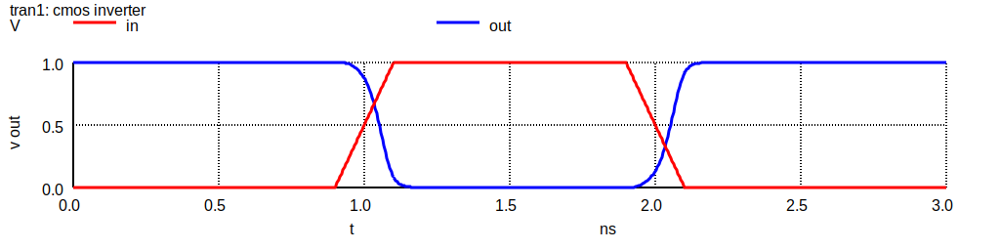

# NGSPICE Simulation of CMOS Circuits <!-- omit in toc -->

**Table of Contents**
- [Summary](#summary)
- [Environments](#environments)
  - [Preparation](#preparation)
  - [Settings](#settings)
  - [Development](#development)
- [Sources](#sources)
  - [`FreePDK45/`](#freepdk45)
  - [`inv.cir`](#invcir)
- [License](#license)

## Summary
SPICE simulation of CMOS Circuits using open-source NGSPICE.

> **Note** This is the course project of *Fundamentals of VLSI Design*, Southeast University, 2023 Spring.

## Environments
### Preparation
Install [NGSPICE](https://ngspice.sourceforge.io/) CLI app.

### Settings
NGSPICE is set to be compatible with HSPICE,
which is set in [`.spiceinit`](.spiceinit).

### Development
My development environments:
- macOS 13 (Ventura) with M1 chip
- NGSPICE 40 (Homebrew version)

## Sources
### `FreePDK45/`
This is a 45nm CMOS library.
See [README](FreePDK45/README) for more information.

### `inv.cir`
Inverter with 1 PMOS and 1 NMOS.
(Design Requirement: TPDR=TPDR when CL=24fF)

Simulate with
```shell
ngspice inv.cir
```

**Designed MOS Parameters**
| MOS | W | L |
| :-: | :-: | :-: |
| PMOS | 450nm | 45nm |
| NMOS | 300nm | 45nm |

TPDR: 0.0523ns, TPDF: 0.0517ns, TPD: 0.0520ns.



## License
Copyright (C) 2023 Wuqiong Zhao (me@wqzhao.org)

This project is distributed by an [MIT license](LICENSE).
