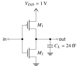
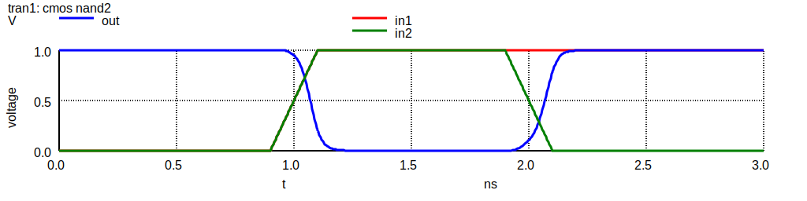
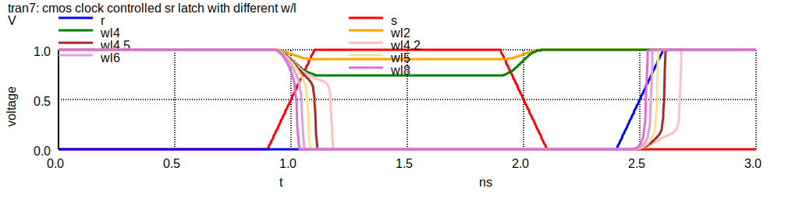
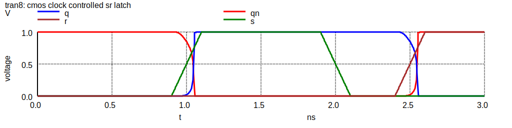

# NGSPICE Simulation of CMOS Circuits <!-- omit in toc -->

- GitHub: [Teddy-van-Jerry/ngspice-cmos](https://github.com/Teddy-van-Jerry/ngspice-cmos)
- Website: [spice.tvj.one](https://spice.tvj.one)
- PDF Report: [`NGSPICE_CMOS_Report.pdf`](report/NGSPICE_CMOS_Report.pdf)

**Table of Contents**
- [Summary](#summary)
- [Environments](#environments)
  - [Preparation](#preparation)
  - [Settings](#settings)
  - [Development](#development)
- [Definitions](#definitions)
- [Sources](#sources)
  - [`FreePDK45/`](#freepdk45)
  - [Inverter](#inverter)
    - [Design](#design)
    - [Simulation](#simulation)
  - [NAND2](#nand2)
    - [Design](#design-1)
    - [Simulation](#simulation-1)
  - [AND2](#and2)
  - [NOR2](#nor2)
    - [Design](#design-2)
    - [Simulation](#simulation-2)
  - [AND8](#and8)
    - [Basic Components](#basic-components)
    - [AND8A (Symmetrical Design)](#and8a-symmetrical-design)
    - [AND8B (NAND4A \* 2 + NOR2 \* 1)](#and8b-nand4a--2--nor2--1)
    - [AND8C (AND4B \* 2 + AND2 \* 1)](#and8c-and4b--2--and2--1)
    - [Analysis](#analysis)
  - [Clock Controlled SR Latch](#clock-controlled-sr-latch)
    - [Schematic Design](#schematic-design)
    - [MOS W/L Design](#mos-wl-design)
    - [Simulation](#simulation-3)
- [License](#license)

## Summary
NGSPICE is a powerful open-source SPICE simulation software in command line,
which can efficiently simulate CMOS circuits.
Basic logic gates, including NOT, NAND, AND, NOR, are implemented and analyzed.
The delay parameters and response plots can help understand the circuit characteristics.
As examples, the 8-input NAND gate with three distinct designs is investigated,
and the clock controlled SR latch is also simulated to design appropriate MOS parameters.

> **Note** This is the course project of *Fundamentals of VLSI Design*, Southeast University, 2023 Spring.

## Environments
### Preparation
Install [NGSPICE](https://ngspice.sourceforge.io/) CLI app.
The schematic plot and the PDF report requires installation of LaTeX.

### Settings
NGSPICE is set to be compatible with HSPICE (see [`.spiceinit`](.spiceinit)).

### Development
My development environments:
- macOS 13 (Ventura) with M1 chip
- NGSPICE 40 (Homebrew version)

> **Warning** There is *no* guarantee that the provided code can run on other platforms or other SPICE tools.
> Make changes if appropriate.

## Definitions
Delay:
- **tr**: rise time (from output crossing 0.1 VDD to 0.9 VDD)
- **tf**: fall time (from output crossing 0.9 VDD to 0.1 VDD)
- **tpdr**: rising propagation delay (from input to rising output crossing VDD/2)
- **tpdf**: falling propagation delay (from input to falling output crossing VDD/2)
- **tpd**: average propagation delay (tpd = (tpdr + tpdf)/2)

Operating corner:
- **SS**: slow-slow
- **NOM**: nominal (average)
- **FF**: fast-fast

## Sources
### `FreePDK45/`
This is a 45nm CMOS library.
See [README](FreePDK45/README) for more information.

`TNOM` is 27C.

### Inverter
Inverter with 1 PMOS and 1 NMOS.
(Design Requirement: tr = tf when CL = 24fF)

- [`inv.inc`](inv.inc) is the `subckt` design;
- [`inv.cir`](inv.cir) is the CMOS inverter simulation.

#### Design

**Schematic**



**Designed MOS Parameters**

|  MOS  |   W   |   L   |
| :---: | :---: | :---: |
| PMOS  | 360nm | 45nm  |
| NMOS  | 225nm | 45nm  |

tr = 119ps, tf = 120ps, tpdr = 60ps, tpdf = 64ps, tpd = 62ps.

**Source** [`inv.inc`](inv.inc)

```spice
.subckt INV gnd i o vdd
  *  src  gate drain body type
  M1 vdd  i    o     vdd  PMOS_VTL W=360nm L=45nm
  M2 gnd  i    o     gnd  NMOS_VTL W=225nm L=45nm
.ends INV
```

#### Simulation

Simulate with
```shell
ngspice inv.cir
```

**Response**


### NAND2

#### Design
The CMOS NAND2 gate is symmetrically designed with parameters for the worst case.

**Schematic**


**Designed MOS Parameters**

|  MOS  | Num |   W   |   L   |
| :---: | :-: | :---: | :---: |
| PMOS  |  2  | 360nm | 45nm  |
| NMOS  |  2  | 450nm | 45nm  |

**Source** [`nand2.inc`](nand2.inc)

```spice
.subckt NAND2 gnd i1 i2 o vdd
  *   src  gate drain body type
  Mp1 vdd  i1   o     vdd  PMOS_VTL W=360nm L=45nm
  Mp2 vdd  i2   o     vdd  PMOS_VTL W=360nm L=45nm
  Mn1 t1   i1   o     gnd  NMOS_VTL W=450nm L=45nm
  Mn2 gnd  i2   t1    gnd  NMOS_VTL W=450nm L=45nm
.ends NAND2
```

#### Simulation

The worst case is simulated. Simulate with
```shell
ngspice nand2.cir
```

**Response**



### AND2

AND2 is [NAND2](#nand2) + [INV](#inverter).

Simulate with
```shell
ngspice and2.cir
```

**Response**


### NOR2

#### Design

**Schematic**


**Source** [`nor2.inc`](nor2.inc)
```spice
.subckt NOR2 gnd i1 i2 o vdd
  *   src  gate drain body type
  Mp1 t1   i1   o     vdd  PMOS_VTL W=720nm L=45nm
  Mp2 vdd  i2   t1    vdd  PMOS_VTL W=720nm L=45nm
  Mn1 gnd  i1   o     gnd  NMOS_VTL W=225nm L=45nm
  Mn2 gnd  i2   o     gnd  NMOS_VTL W=225nm L=45nm
.ends NOR2
```

#### Simulation

Simulate with
```shell
ngspice nor2.cir
```

**Response**


### AND8

8-input AND gate.
With a large fan-in, there can be several designs.
Here we want to investigate the performance of different designs.

The test circuit (defined in [add8_test_inv2.inc](add8_test_inv2.inc))
involves a 24fF capacitor load at the output,
and 8 sets of two stages of inverters for each input.
For the inverter in the test circuit,
NMOS has W = 0.75um, L = 0.25um,
and PMOS has W = 2.60um, L = 0.25um.

The response simulation has the PVT condition of 1.0V, FF, 25°C.

#### Basic Components

##### NAND4A <!-- omit in toc -->
This directly extends the structure of NAND2 into NAND4.


##### NAND8A <!-- omit in toc -->
This directly extends the structure of NAND2 into NAND8.


#### AND8A (Symmetrical Design)

This is the most basic case, extending 2-input NAND to 8-input NAND,
before applying an inverter.

**Schematic**


|  PVT Condition  | tr (ps) | tf (ps) | tpdr (ps) | tpdf (ps) | P static (uW) | P dynamic (uW) |
|:---------------:|:-------:|:-------:|:---------:|:---------:|:-------------:|:--------------:|
|  0.9V, SS, 70°C |  132.6  |  136.9  |   137.3   |   159.9   |     0.076     |      2.366     |
| 1.35V, SS, 70°C |  110.6  |  124.4  |   102.4   |   125.9   |     1.023     |      5.591     |
| 1.0V, NOM, 25°C |   90.5  |   99.2  |    83.8   |   110.5   |     0.227     |      2.733     |
| 1.5V, NOM, 25°C |   79.8  |   95.0  |    69.4   |    92.4   |     6.566     |      9.669     |
|  1.1V, FF, 0°C  |   72.5  |   84.6  |    62.7   |    89.4   |     0.955     |      5.321     |
|  1.65V, FF, 0°C |   69.1  |   83.6  |    54.2   |    75.3   |     51.582    |      1.121     |

**Response**


#### AND8B (NAND4A * 2 + NOR2 * 1)

**Schematic**


|  PVT Condition  | tr (ps) | tf (ps) | tpdr (ps) | tpdf (ps) | P static (uW) | P dynamic (uW) |
|:---------------:|:-------:|:-------:|:---------:|:---------:|:-------------:|:--------------:|
|  0.9V, SS, 70°C |  118.8  |  131.7  |   102.8   |   106.2   |     0.030     |      2.233     |
| 1.35V, SS, 70°C |   96.2  |  113.1  |    78.3   |    83.3   |     0.641     |      6.204     |
| 1.0V, NOM, 25°C |   77.2  |   94.9  |    62.7   |    73.0   |     0.125     |      2.592     |
| 1.5V, NOM, 25°C |   65.7  |   85.5  |    52.0   |    61.0   |     4.895     |     12.301     |
|  1.1V, FF, 0°C  |   59.4  |   79.9  |    46.2   |    58.8   |     0.510     |      5.289     |
|  1.65V, FF, 0°C |   53.3  |   74.3  |    30.5   |    50.3   |     43.767    |     11.248     |

**Response**


#### AND8C (AND4B * 2 + AND2 * 1)

**Schematic**


|  PVT Condition  | tr (ps) | tf (ps) | tpdr (ps) | tpdf (ps) | P static (uW) | P dynamic (uW) |
|:---------------:|:-------:|:-------:|:---------:|:---------:|:-------------:|:--------------:|
|  0.9V, SS, 70°C |  118.8  |  120.3  |   103.3   |   105.0   |     0.111     |      3.067     |
| 1.35V, SS, 70°C |   96.7  |  102.6  |    79.8   |    83.5   |     1.253     |      9.458     |
| 1.0V, NOM, 25°C |   81.5  |   86.9  |    68.4   |    73.3   |     0.301     |      4.164     |
| 1.5V, NOM, 25°C |   69.1  |   77.8  |    56.6   |    62.4   |     8.471     |     16.348     |
|  1.1V, FF, 0°C  |   65.0  |   73.0  |    53.6   |    60.0   |     1.175     |      6.652     |
|  1.65V, FF, 0°C |   47.9  |   67.8  |    46.9   |    52.2   |     73.357    |     20.798     |

**Response**


#### Analysis
Among the three designs ([AND8A](#and8a-symmetrical-design), [AND8B](#and8b-nand4a--2--nor2--1) and [AND8C](#and8c-and4b--2--and2--1)),
[AND8B](#and8b-nand4a--2--nor2--1) has the smallest latency,
closely followed by [AND8c](#and8c-and4b--2--and2--1),
and the largest latency is observed with [AND8A](#and8a-symmetrical-design).
Compared with [AND8A](#and8a-symmetrical-design), the fan-in of [AND8B](#and8b-nand4a--2--nor2--1) is significantly reduced,
resulting in lower latency.
Though [AND8C](#and8c-and4b--2--and2--1) has an even smaller fan-in, the number of stages in the circuit is larger than that of [AND8B](#and8b-nand4a--2--nor2--1).
Thus, [AND8B](#and8b-nand4a--2--nor2--1) achieves a reasonable tradeoff, and has the lowest latency.

There are also some other observations:
- A larger VDD can reduce the latency to some extent, but resulting in much larger power consumption.
- A faster operating corner (FF > NOM > SS) will help cut down latency, but also increases power.
- A higher temperature increases power in return for a reduced latency.

### Clock Controlled SR Latch

#### Schematic Design

2 PMOS + 6 NMOS


**Source** [`SR_latch_clk.inc`](SR_latch_clk.inc)
```spice
* .param WL = 5
.subckt SR_LATCH_CLK gnd s r clk q qn vdd
  *  src  gate drain body type
  M1 qn   q    gnd   gnd  NMOS_VTL W=     90nm L=45nm
  M2 qn   q    vdd   vdd  PMOS_VTL W=    270nm L=45nm
  M3 q    qn   gnd   gnd  NMOS_VTL W=     90nm L=45nm
  M4 q    qn   vdd   vdd  PMOS_VTL W=    270nm L=45nm
  M5 ts   s    gnd   gnd  NMOS_VTL W={WL*45nm} L=45nm
  M6 qn   clk  ts    gnd  NMOS_VTL W={WL*45nm} L=45nm
  M7 tr   r    gnd   gnd  NMOS_VTL W={WL*45nm} L=45nm
  M8 q    clk  tr    gnd  NMOS_VTL W={WL*45nm} L=45nm
.ends SR_LATCH_CLK
```
You need to specify the parameter `WL`, for example `.param WL = 5`.

#### MOS W/L Design

We need to determine the appropriate W/L for `M5` to `M8`.
Using a sweep, implemented by `alterparam` within a `foreach` loop,
we can obtain the following graph.



Clearly, we need W/L > 4.5 (at least 4.2) for the latch to work properly.
(`M1`/`M3` and `M2`/`M4` have W/L as 2 and 6, respectively.)

#### Simulation

```sh
ngspice SR_latch_clk.cir
```

**Response**



## License
Copyright (C) 2023 Wuqiong Zhao (me@wqzhao.org)

This project is distributed by an [MIT license](LICENSE).
